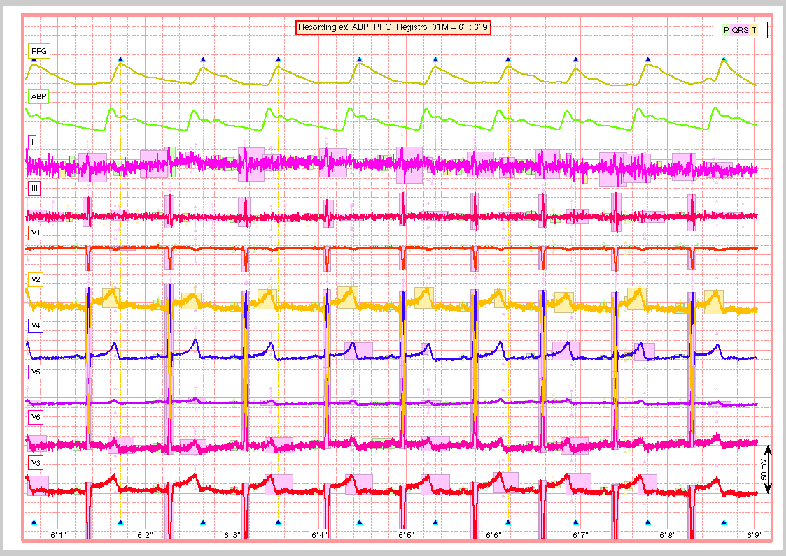

Another example
===============

This script exemplifies the use of the ECGkit in a multimodal
cardiovascular recording which includes arterial blood pressure (ABP),
plethysmographic (PPG) and electrocardiogram signals. The following
tasks will be performed in this example:

-  :ref:`Heartbeat/QRS detection <QRS_automatic_detection>`
-  :ref:`ABP/PPG pulse detection <PPG_ABP_pulse_detection>`
-  :ref:`ECG wave delineation <ECG_automatic_delineation>`
-  :ref:`Heartbeat classification <Automatic_Heartbeat_classification>`
-  :ref:`Report generation <Visual_inspection_of_the_signal>`

Each automatic step is followed by a manual verification step in order
to verify the algorithm's results. The script is prepared to run locally
without arguments, as well as in a cluster environment by using
"pid\_str" argument. The pid\_str argument is a char with format 'N/M',
being N <= M with default value '1/1'. You can partition a big job into
M pieces in cluster architecture, by starting M processes with N ranging
from 1 to M.

You can watch a typical run of this script for small, local ECG
recording on
`YouTube <https://www.youtube.com/watch?v=8lJtkGhrqFw&list=PLlD2eDv5CIe9sA2atmnb-DX48FIRG46z7>`__.

Example of how to run this script

.. code::

	examples()
	examples('1/1', 'C:\Your_preferred_local_path\', 'arbitrary_string')
	examples('1/10', '/Your_preferred_path_in_cluster/', 'arbitrary_string')        

Contents
--------
	

-  :ref:`Function prototype <Function_prototype>`
-  :ref:`Argument parsing <Argument_parsing>`
-  :ref:`QRS automatic detection <QRS_automatic_detection>`
-  :ref:`QRS visual inspection and
   correction <QRS_visual_inspection_and_correction>`
-  :ref:`PPG/ABP pulse detection <PPG_ABP_pulse_detection>`
-  :ref:`PPG/ABP waves visual inspection and
   correction <PPG_ABP_waves_visual_inspection_and_correction>`
-  :ref:`ECG automatic delineation <ECG_automatic_delineation>`
-  :ref:`Visual inspection of the
   detection/delineation <Visual_inspection_of_the_detection_delineation>`
-  :ref:`Automatic Heartbeat
   classification <Automatic_Heartbeat_classification>`
-  :ref:`Visual inspection of the
   signal <Visual_inspection_of_the_signal>`
-  :ref:`Other user-defined tasks ... <Other_user-defined_tasks>`

.. _Function_prototype:

Function prototype
------------------

.. code::

    function examples(pid_str, examples_path, user_str)
            

*examples* accepts three *optional* arguments:

-  **pid\_str** (optional) string identifier for this work instance in
   a cluster computing or multitask environment. The identifier follows
   the form 'N/M', being N a number which identifies this execution
   instance and M the total amount of instances. ``'1/1' (default)``
-  **examples\_path** (optional) string of the path with ECG
   recordings. ``['.' filesep 'example_recordings' filesep ] (default)``;
-  **user\_str** (optional) string to identify this run or experiment.

.. _Argument_parsing:

Argument parsing
----------------

Simple and straight forward.

.. code::

        if( nargin < 1 || ~ischar(pid_str) )
            % single PID run
            pid_str = '1/1';
        end
        if( nargin < 2 || ~exist(examples_path, 'dir') )
            % inspect ECG files in rootpath\example_recordings\ folder
            root_path = fileparts(mfilename('fullpath'));
            % default folder to look at
            examples_path = [root_path filesep 'example_recordings' filesep ];
            if(~exist(examples_path, 'dir'))
                disp_string_framed(2, 'Please provide a valid path with ECG recordings');
                return
            end
        else
            if( examples_path(end) ~= filesep )
                examples_path = [examples_path filesep];
            end
        end
        if( nargin < 3  )
            user_str = '';
        end
    % Explore the *examples_path* for ECG recordings.
        filenames = dir(examples_path);
        recnames = {filenames(:).name};
    % In this case I hardcoded only one recording
        recnames = {'ex_ABP_PPG_Registro_01M'};
    % But you can use this to iterate for all of them.
    %     [~,recnames] = cellfun(@(a)(fileparts(a)), recnames, 'UniformOutput', false);
    %     recnames = unique(recnames);
    %     recnames = setdiff(recnames, {'' '.' '..' 'results' 'condor' });
    %     recnames = recnames(1)
        lrecnames = length(recnames);
        % In case of running in a user-assisted fashion.
        bUseDesktop = usejava('desktop');
        if( bUseDesktop )
            tmp_path = tempdir;
            output_path = [ examples_path 'results' filesep ];
        else
            % For cluster or distributed environment processing.
            InstallECGkit();
            % this is a local path, usually faster to reach than output_path
            tmp_path = '/scratch/';
            % distributed or cluster-wide accesible path
            output_path = [ examples_path 'results' filesep ];
        end
    % just for debugging, keep it commented.
    %     bUseDesktop = false

.. _QRS_automatic_detection:

QRS automatic detection
-----------------------

In this example the first step is the location of each heartbeat, or QRS
complexes detection. To achieve this, the kit includes the following
algorithms:

-  Wavedet
-  Pan & Tompkins
-  gqrs
-  sqrs
-  wqrs
-  ecgpuwave

The way of performing QRS detection (or almost any other task in this
ECGkit) is through an :doc:`ECGwrapper <ECGwrapper>` object. The objective 
of this object is to abstract or separate any algorithm from the particular 
details of the ECG signal. This object is able to invoke any kind of algorithm 
through the interface provided of other object, called :doc:`ECGtask <ECGtask>` objects.

The :doc:`ECGtask <ECGtask>` objects actually perform specific task on the ECG signal,
in this case, the QRS complex detection. Each task have general
properties such as *progress\_handle* (see
:doc:`ECGtask <ECGtask>` class properties for more details) and other specific for a certain task, such as
*detectors*, *only\_ECG\_leads*, *wavedet\_config*,
*gqrs\_config\_filename* (see others in :doc:`QRS detection task <QRS_detection>`).

.. code::

	    % go through all files
	    ECG_all_wrappers = [];
	    jj = 1;
	    for ii = 1:lrecnames
	        rec_filename = [examples_path recnames{ii}];
	        % task name,
	%         ECGt_QRSd = 'QRS_detection';
	        % or create an specific handle to have more control
	        ECGt_QRSd = ECGtask_QRS_detection();
	%         % select an specific algorithm. Default: Run all detectors
	%         ECGt_QRSd.detectors = 'wavedet'; % Wavedet algorithm based on
	%         ECGt_QRSd.detectors = 'pantom';  % Pan-Tompkins alg.
	%         ECGt_QRSd.detectors = 'gqrs';    % WFDB gqrs algorithm.
	%         % Example of how you can add your own QRS detector.
	%         ECGt_QRSd.detectors = 'user:example_worst_ever_QRS_detector';    
	%         ECGt_QRSd.detectors = 'user:your_QRS_detector_func_name';    %
	%         "your_QRS_detector_func_name" can be your own detector.
	        ECGt_QRSd.detectors = {'wavedet' 'gqrs' 'wqrs' 'user:example_worst_ever_QRS_detector'};
	        % you can individualize each run of the QRS detector with an
	        % or group by the config used
	%         ECGt_QRSd.only_ECG_leads = false;    % consider all signals ECG
	        ECGt_QRSd.only_ECG_leads = true;    % Identify ECG signals based on their header description.
	        ECG_w = ECGwrapper( 'recording_name', rec_filename, ...
	                            'this_pid', pid_str, ...
	                            'tmp_path', tmp_path, ...
	                            'output_path', output_path, ...
	                            'ECGtaskHandle', ECGt_QRSd);
	        % external string
	        ECG_w.user_string = user_str;
	        try
	            % process the task
	            ECG_w.Run;
	            % collect object if were recognized as ECG recordings.
	            if( jj == 1)
	                ECG_all_wrappers = ECG_w;
	            else
	                ECG_all_wrappers(jj) = ECG_w;
	            end
	            jj = jj + 1;
	        catch MException
	            if( strfind(MException.identifier, 'ECGwrapper:ArgCheck:InvalidFormat') )
	                disp_string_framed('*Red', sprintf( 'Could not guess the format of %s', ECG_w.recording_name) );
	            else
	                % report just in case
	                report = getReport(MException);
	                fprintf(2, '\n%s\n', report);
	            end
	        end
	    end
	    % recognized recordings
	    lrecnames = length(ECG_all_wrappers);
	    % at the end, report problems if happened.
	    for ii = 1:lrecnames
	        ECG_all_wrappers(ii).ReportErrors;
	    end

	
.. _QRS_visual_inspection_and_correction:
			
QRS visual inspection and correction
------------------------------------

This part of the example uses a graphical user interface (GUI) to allow
the user correcting mistakes that the previous automatic algorithm
eventually makes.

As can be seen in the following code, the first step is checking that
the previous QRS detection task finished without problems. Then if no
errors, the corrector will use as starting point the result of this same
task, in case the user would like to edit a previously edited result, or
if not available the result of the QRS detection task.

.. code::

        if( bUseDesktop )
            % other task can be performed on the same objects
            for ii = 1:lrecnames
                % last worker is the responsible of the visual correction.
                if( ECG_all_wrappers(ii).this_pid == ECG_all_wrappers(ii).cant_pids)
                    % if there are not any previous error.
                    if( ECG_all_wrappers(ii).Processed && ~ECG_all_wrappers(ii).Error )
                        % this is to use previous saved results as starting point,
                        % if any available
                        cached_filenames = ECG_all_wrappers(ii).GetCahchedFileName({'QRS_corrector' 'QRS_detection'});
                        % if no previous correction work, try the automatic
                        % detection task
                        % if any, do the correction
                        if( ~isempty(cached_filenames) )
                            % this is to use previous saved results as starting point,
                            % if any available
                            ECG_all_wrappers(ii).ECGtaskHandle = 'QRS_corrector';
                            % This task is supposed to be supervised, so only one pid is enough.
                            ECG_all_wrappers(ii).this_pid = '1/1';
                            % user provided name to individualize each run
                            ECG_all_wrappers(ii).user_string = user_str;
                            % to avoid loading cached results and exit, this flag
                            % allows the re-editing of the current state of the
                            % detections.
                            ECG_all_wrappers(ii).cacheResults = false;
                            % maybe in your application you should run this for
                            % all files.
                            ECG_all_wrappers(ii).ECGtaskHandle.payload = load(cached_filenames{1});
                            % process the task
                            ECG_all_wrappers(ii).Run;
                            % restore the original pids configuration
                            ECG_all_wrappers(ii).this_pid = pid_str;
                            % As we changed for "QRS correction" task, we have to enable this
                            % value again in order to avoid performing the following tasks every time.
                            % If you want to recalculate any task, change it to false
                            ECG_all_wrappers(ii).cacheResults = true;
                        end
                    end
                end
            end
            % at the end, report problems if happened.
            for ii = 1:lrecnames
                ECG_all_wrappers(ii).ReportErrors;
            end
        end
            

Then the task invoked by the wrapper object is changed to `QRS corrector
task <../../../../../../:D:/Mariano/misc/ECGkit/help/robohelp/ECGkit/matlab:edit('ECGtask_QRS_corrector.m')>`__
and the GUI is presented to the user.

|image4|

In this example, the GUI have four plots to represent the RR interval
series, the two in the top-left show the RR interval versus time at
different time windows. The bigger in the top-right, shows a *Poincaré*
plot, that is the current RR interval versus the following in the serie.
The plot in the bottom shows the selected signal/s versus time. Then the
user can interact with the plots according to the `QRS corrector
documentation <../../../../../../:D:/Mariano/misc/ECGkit/help/robohelp/ECGkit/matlab:doc('ECGtask_QRS_corrector')>`__

.. _PPG_ABP_pulse_detection:

PPG/ABP pulse detection
-----------------------

In case the recording includes pulsatile signals, such as
plethysmographic (PPG) or arterial blood pressure (ABP), this kit
includes the `PPG/ABP automatic detector
task <../../../../../../:D:/Mariano/misc/ECGkit/help/robohelp/ECGkit/matlab:doc('ECGtask_PPG_ABP_detector')>`__
which allows the use of two algorithms to perform peak detection,
`WavePPG <../../../../../../:D:/Mariano/misc/ECGkit/help/robohelp/ECGkit/matlab:doc('PPG_pulses_detector')>`__
and `Physionet's wabp <wabp-1.htm','-browser')>`__.

other task can be performed on the same objects

.. code::

        for ii = 1:lrecnames
            % set the delineator task name and run again.
            ECG_all_wrappers(ii).ECGtaskHandle = 'PPG_ABP_detector';
            % user provided name to individualize each run
            ECG_all_wrappers(ii).user_string = user_str;
            % process the task
            ECG_all_wrappers(ii).Run;
        end
        % at the end, report problems if happened.
        for ii = 1:lrecnames
            ECG_all_wrappers(ii).ReportErrors;
        end
            

.. _PPG_ABP_waves_visual_inspection_and_correction:
			
PPG/ABP waves visual inspection and correction
----------------------------------------------

The same manual verification made for automatic QRS detection algorithms
can be performed with pulsatile signals. The `PPG/ABP corrector
task <../../../../../../jsD:/Mariano/misc/ECGkit/help/robohelp/ECGkit/matlab:doc('ECGtask_PPG_ABP_corrector')>`__
was designed to allow users the verification and correction of automatic
detections through the same GUI.

|image5|

The following code shows how to use this task. As you can note, the
interface is almost the same used for the QRS correction task.

.. code::

        if( bUseDesktop )
            % other task can be performed on the same objects
            for ii = 1:lrecnames
                % last worker is the responsible of the visual correction.
                if( ECG_all_wrappers(ii).this_pid == ECG_all_wrappers(ii).cant_pids)
                    % if there are not any previous error.
                    if( ECG_all_wrappers(ii).Processed && ~ECG_all_wrappers(ii).Error )
                        % this is to use previous saved results as starting point,
                        % if any available
                        cached_filenames = ECG_all_wrappers(ii).GetCahchedFileName({'PPG_ABP_corrector' 'PPG_ABP_detector'});
                        % if no previous correction work, try the automatic
                        % detection task
                        % if any, do the correction
                        if( ~isempty(cached_filenames) )
                            % this is to use previous saved results as starting point,
                            % if any available
                            ECG_all_wrappers(ii).ECGtaskHandle = 'PPG_ABP_corrector';
                            % This task is supposed to be supervised, so only one pid is enough.
                            ECG_all_wrappers(ii).this_pid = '1/1';
                            % user provided name to individualize each run
                            ECG_all_wrappers(ii).user_string = user_str;
                            % to avoid loading cached results and exit, this flag
                            % allows the re-editing of the current state of the
                            % detections.
                            ECG_all_wrappers(ii).cacheResults = false;
                            % maybe in your application you should run this for
                            % all files.
                            ECG_all_wrappers(ii).ECGtaskHandle.payload = load(cached_filenames{1});
                            % process the task
                            ECG_all_wrappers(ii).Run;
                            % restore the original pids configuration
                            ECG_all_wrappers(ii).this_pid = pid_str;
                            % As we changed for "QRS correction" task, we have to enable this
                            % value again in order to avoid performing the following tasks every time.
                            % If you want to recalculate any task, change it to false
                            ECG_all_wrappers(ii).cacheResults = true;
                        end
                    end
                end
            end
            % at the end, report problems if happened.
            for ii = 1:lrecnames
                ECG_all_wrappers(ii).ReportErrors;
            end
        end
            

.. _ECG_automatic_delineation:
			
ECG automatic delineation
-------------------------

Once the QRS complexes were detected, each heartbeat can be segmented or
delineated into P-QRS-T waves. To achieve this the kit includes an `ECG
delineation
task <../../../../../../:D:/Mariano/misc/ECGkit/help/robohelp/ECGkit/matlab:doc('ECGtask_ECG_delineation')>`__
to interface with the
`wavedet <articleDetails.jsp?arnumber=1275572','-browser')>`__ and
others user-defined algorithms, as described in the `task
help <../../../../../../:D:/Mariano/misc/ECGkit/help/robohelp/ECGkit/matlab:doc('ECGtask_ECG_delineation')>`__.
The interface follows the same guidelines described before, as is shown
in the following code.

other task can be performed on the same objects

.. code::

        for ii = 1:lrecnames
            % this is to use previous cached results as starting point
            cached_filenames = ECG_all_wrappers(ii).GetCahchedFileName('QRS_corrector');
            % if corrected QRS detections are not available, wavedet
            % performs automatic QRS detection.
            if( ~isempty(cached_filenames) )
                % this is to use previous result from the automatic QRS
                % detection
                ECG_all_wrappers(ii).ECGtaskHandle.payload = load(cached_filenames{1});
            end
            % set the delineator task name and run again.
            ECG_all_wrappers(ii).ECGtaskHandle = 'ECG_delineation';
            % user provided name to individualize each run
            ECG_all_wrappers(ii).user_string = user_str;
            % Identify ECG signals based on their header description and
            % perform delineation in those leads.
            ECG_all_wrappers(ii).ECGtaskHandle.only_ECG_leads = true;
    %         ECGt_QRSd.detectors = 'wavedet'; % Wavedet algorithm based on
    %         ECGt_QRSd.detectors = 'user:example_worst_ever_ECG_delineator';
    %         % Example of how you can add your own ECG delineator.
    %         ECGt_QRSd.detectors = 'user:your_ECG_delineator_func_name';
    %         "your_ECG_delineator_func_name" can be your own delineator.
            ECG_all_wrappers(ii).ECGtaskHandle.delineators = {'wavedet' 'user:example_worst_ever_ECG_delineator'};
            % process the task
            ECG_all_wrappers(ii).Run;
        end
        % at the end, report problems if happened.
        for ii = 1:lrecnames
            ECG_all_wrappers(ii).ReportErrors;
        end
            
.. _Visual_inspection_of_the_detection_delineation:

Visual inspection of the detection/delineation
----------------------------------------------

The same manual verification made for all the previous automatic tasks
is repeated for ECG delineation. The `ECG delineation corrector
task <../../../../../../jsD:/Mariano/misc/ECGkit/help/robohelp/ECGkit/matlab:doc('ECGtask_ECG_delineation_corrector')>`__
was designed to allow users the verification and correction of automatic
delineation through the same GUI. The only difference with respect to
the behaviour of the QRS or PPG/ABP correction GUI, is that addition of
new events to the P-QRS-T series is not allowed, in order to keep the
assosiation of a wave fiducial point to a heartbeat.

|image6|

.. code::

        if( bUseDesktop )
            % other task can be performed on the same objects
            for ii = 1:lrecnames
                % last worker is the responsible of the visual correction.
                if( ECG_all_wrappers(ii).this_pid == ECG_all_wrappers(ii).cant_pids)
                    % if there are not any previous error.
                    if( ECG_all_wrappers(ii).Processed && ~ECG_all_wrappers(ii).Error )
                        % this is to use previous saved results as starting point,
                        % if any available
                        cached_filenames = ECG_all_wrappers(ii).GetCahchedFileName( {'ECG_delineation_corrector' 'ECG_delineation'} );
                        % if no previous correction work, try the automatic
                        % detection task
                        % if any, do the correction
                        if( ~isempty(cached_filenames) )
                            % this is to use previous saved results as starting point,
                            % if any available
                            ECG_all_wrappers(ii).ECGtaskHandle = 'ECG_delineation_corrector';
                            % This task is supposed to be supervised, so only one pid is enough.
                            ECG_all_wrappers(ii).this_pid = '1/1';
                            % user provided name to individualize each run
                            ECG_all_wrappers(ii).user_string = user_str;
                            % to avoid loading cached results and exit, this flag
                            % allows the re-editing of the current state of the
                            % detections.
                            ECG_all_wrappers(ii).cacheResults = false;
                            % maybe in your application you should run this for
                            % all files.
                            ECG_all_wrappers(ii).ECGtaskHandle.payload = load(cached_filenames{1});
                            % process the task
                            ECG_all_wrappers(ii).Run;
                            % restore the original pids configuration
                            ECG_all_wrappers(ii).this_pid = pid_str;
                            % As we changed for "QRS correction" task, we have to enable this
                            % value again in order to avoid performing the following tasks every time.
                            % If you want to recalculate any task, change it to false
                            ECG_all_wrappers(ii).cacheResults = true;
                        end
                    end
                end
            end
            % at the end, report problems if happened.
            for ii = 1:lrecnames
                ECG_all_wrappers(ii).ReportErrors;
            end
        end
            
.. _Automatic_Heartbeat_classification:
			
Automatic Heartbeat classification
----------------------------------

The last task described in this example is the classification of
heartbeats according to the `EC-57 AAMI
recommendation <matlab:web('http://marketplace.aami.org/eseries/scriptcontent/docs/Preview%20Files/EC57_1212_preview.pdf','-browser')>`__.
To achieve this task, the kit includes a `Heartbeat classification
task <../../../../../../jsD:/Mariano/misc/ECGkit/help/robohelp/ECGkit/matlab:doc('ECGtask_heartbeat_classifier')>`__
that interfaces with the `Argentino-Aragonés heartbeat classifier
(a2hbc) <','-browser')>`__ project in order to classify heartbeats into
the following classes:

-  **N** normal
-  **S** supraventricular
-  **V** ventricular
-  **F** fusion of normal and ventricular

The *a2hbc* algorithm can opperate automatically or assisted by the
user, for more details check the `a2hbc
documentation <../../../../../../:D:/Mariano/misc/ECGkit/help/robohelp/ECGkit/matlab:doc('a2hbc')>`__.

.. code::

        for ii = 1:lrecnames
            % this is to use previous cached results as starting point
            cached_filenames = ECG_all_wrappers(ii).GetCahchedFileName({'QRS_corrector' 'QRS_detection'});
            % if corrected QRS detections are not available, wavedet
            % performs automatic QRS detection.
            if( ~isempty(cached_filenames) )
                ECG_all_wrappers(ii).ECGtaskHandle = 'ECG_heartbeat_classifier';
                % the heartbeat classifier uses the QRS detection performed
                % before, if available the task will use the corrected
                % detections.
                ECG_all_wrappers(ii).ECGtaskHandle.payload = load(cached_filenames{1});
                % modes of operation of the a2hbc algorithm
                ECG_all_wrappers(ii).ECGtaskHandle.mode = 'auto';
    %             ECG_all_wrappers(ii).ECGtaskHandle.mode = 'slightly-assisted';
    %             ECG_all_wrappers(ii).ECGtaskHandle.mode = 'assisted';
                % user provided name to individualize each run
                ECG_all_wrappers(ii).user_string = user_str;
                % process the task
                ECG_all_wrappers(ii).Run;
            end
        end
        % at the end, report problems if happened.
        for ii = 1:lrecnames
            ECG_all_wrappers(ii).ReportErrors;
        end
            
.. _Visual_inspection_of_the_signal:
			
Visual inspection of the signal
-------------------------------

Finaly a report is generated with the results of the previous tasks,
either in a pdf document or several images. The report generated can be
customized with the interface described in the
`documentation <../../../../../../:D:/Mariano/misc/ECGkit/help/robohelp/ECGkit/matlab:doc('reportECG')>`__.
The following are just three examples of a longer report:

|image7|

A snapshot of the center

|image8|

And finaly a snapshot of the last part of the recording.

|image9|

This is the code used to create a PDF report.

.. code::

        filename = []; % default setting. Let the report function decide.
    %     filename = 'container_filename'; % to put everything in one big file.
        % other winlengths can be added to the array in order to further
        % explore the recordings, and the algorithm results.
    %     winlengths = []; % default setting
        winlengths = [ 7 ]; %seconds
        % go through all files
        for ii = 1:lrecnames
            if( ECG_all_wrappers(ii).this_pid == ECG_all_wrappers(ii).cant_pids)
                % last worker is the responsible of the reporting.
                if( ECG_all_wrappers(ii).this_pid == ECG_all_wrappers(ii).cant_pids)
                    try
                        reportECG(ECG_all_wrappers(ii), 'LowDetail', 'full', winlengths, 'pdf', filename );
                    catch MException
                        report = getReport(MException);
                        fprintf(2, '\n%s\n', report);
                    end
                end
            end
        end
            
.. _Other_user-defined_tasks:
			
Other user-defined tasks ...
----------------------------

Maybe the most important and useful aspect of the kit, is that you can
add your own algorithms. This can be done by following the interface
documented through the several examples included above. The `QRS
detection <../../../../../../:D:/Mariano/misc/ECGkit/help/robohelp/ECGkit/matlab:doc('ECGtask_QRS_detection')>`__
and `ECG
delineation <../../../../../../:D:/Mariano/misc/ECGkit/help/robohelp/ECGkit/matlab:doc('ECGtask_ECG_delineation')>`__
tasks already include a way to interface your own algorithms through the
**user:function\_name** method. Check the above sections for more
details.

.. code::

        if( ~bUseDesktop )
            UnInstallECGkit();
        end
            

.. |image4| image:: QRS_corrector.PNG
.. |image5| image:: PPG-ABP_corrector.PNG
.. |image6| image:: ECG_delineator_corrector.png
.. |image7| image:: ex_ABP_PPG_Registro_01M_full_Pagina_01.png

.. |image9| image:: ex_ABP_PPG_Registro_01M_full_Pagina_10.png
