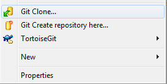

Getting Started
===============

.. toctree::
   :hidden:

   Release notes <release-notes>
   Be in touch <contact>

Installation
------------

The easiest way to install the latest stable version is downloading the project in `zip or tgz <http://marianux.github.io/ecg-kit/>`__. If you want the latest development version, clone the master branch with your favorite GIT client. `Here <https://git-scm.com/downloads>`__ you can find one for each supported platform, and a nice GUI for Windows called `Tortoise <https://code.google.com/p/tortoisegit/>`__. Then go to an empty folder, right click there and select *Git Clone*

|image1|

or execute in the shell:

.. code:: 

	git clone --recursive git@github.com:marianux/ecg-kit.git

To install the kit, after unpacking or cloning the kit to
'your\_installation\_folder', then type in Matlab

.. code:: 

    cd 'your_installation_folder'
    InstallECGkit()

Here you have a `Youtube <https://www.youtube.com/watch?v=8lJtkGhrqFw&list=PLlD2eDv5CIe9sA2atmnb-DX48FIRG46z7&index=1>`__ video
of a typical installation. You can try then the ``examples.m`` script in order to check the correct
installation in some included recordings:

.. code:: 

    examples()

or if you want to try in your own recordings:

.. code:: 

     examples('1/1', 'C:\Your_own_recordings\')

The use of this script is explained more in detail in the
:doc:`Examples <examples>` section.

Uninstallation
--------------

Uninstallation is as easy as typing:

.. code:: 

    UnInstallECGkit()

`Here <https://www.youtube.com/watch?v=LtWJ5VA3L2o&list=PLlD2eDv5CIe9sA2atmnb-DX48FIRG46z7&index=7>`__ 
you can check a typical uninstallation video as well

