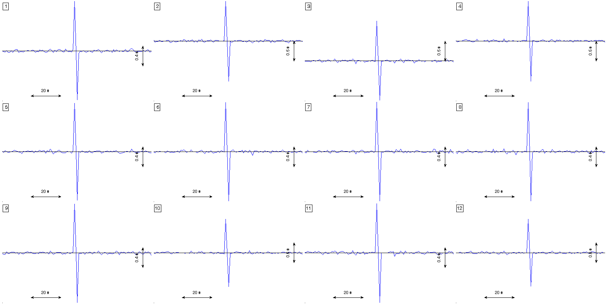
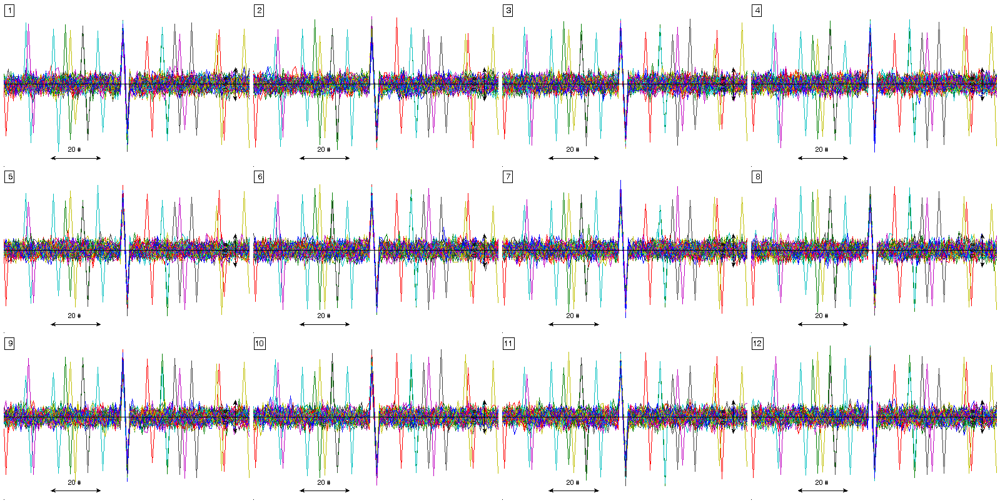

Plotting signal mosaics
=======================

Low level function to produce mosaic charts of signals and annotations. 
This function plots several subplots in the same figure in order to do a
mosaic with the different leads available in ECG. Annotations can be
provided individually or for all the mosaics.

Prototype
---------

The function prototype is the following.

.. code::

		[ ECG_hdl axes_hdl fig_hdl all_yranges ] = plot_ecg_mosaic( ECG, varargin )

This function accepts as arguments the arg_name/arg_val method described below.
			 
Arguments
---------
 
- ECG: [numeric or cell] REQUIRED
   
   - [numeric]: signal matrix of dimension ``[sig_length sig_size repetitions_size]`` where:
	 
	 - sig_length: time length in samples
	 
	 - sig_size: number of ECG leads or number of signals.
	 
	 - repetitions_size: number of repetitions of the same
	   signals. Typically used when time-synchronized events, like
	   heartbeats.  
   
   - [cell]: cell array of length repetitions_size, where each cell
     is (probably a time alligned event) a signal of dimension
     ``[sig_length sig_size]``

- QRS_locations: [numeric] OPTIONAL. Synchronization sample. In ECG context, this values are
  the QRS fiducial point. ``[] (default)``

- WinSize: [numeric] OPTIONAL. Width of the window around each fiducial point provided in
  QRS_locations. ``[] (default)``

- ECG_header: [struct] OPTIONAL. Description of the ECG typically available in the
  ECG_header as described :ref:`here<ECG_header_description>`. 
		 
- MaxECGrange: [numeric or string] OPTIONAL. Force a vertial range in order to ease visual 
  comparison of signals in the mosaic. 
  
  [string] 
    
	'max': force the maximum range to be the range
		   for all mosaics.
		   
    'min', 'mean', 'median': are also available options.
	
    'none': Each mosaic with a different range. (Default).

- RowsCols: [numeric] OPTIONAL. Number of rows and columns of the mosaic. If ommited or if 
  ``rows * cols ~= ECG_header.nsig``, these values are automatically adapted to the best fit 
  mosaic in relation to the aspect ratio of the screen.   

- FigureHdl: [figure handle] OPTIONAL. Choose the figure to be produced the mosaic. ``gcf (default)``

- ECG_delineation: [struct] OPTIONAL. Annotation struct described :ref:`here<delineation_struct>`. 

- ECG_annotations: [cell] OPTIONAL. Annotations to be included in the mosaic. The function accepts 2 
  type of annotations: points and lines. An example below shows how to define both annotations.

  
Output:

- ECG_hdl: handle to the plotted signals.

- axes_hdl: handle to the axes.

- fig_hdl: handle to fig.

- all_yranges: vertical ranges of the plotted signals.

Example
-------

The following example shows some typical use of the function

.. code::

	win_size = 100; 
	sig_samp = 10000;
	sig_size = 12;
	event_size = 50;
	x = 0.1*randn(sig_samp,sig_size); 
	event_locations = randsample(win_size:sig_samp-win_size, event_size);
	x(event_locations-1,:) = x(event_locations-1,:) + 1;
	x(event_locations+1,:) = x(event_locations+1,:) - 1;
	x_packed = pack_signal(x, event_locations, win_size);    

	figure(1)
	% estimation of the signal averaged event
	plot_ecg_mosaic( mean(x_packed,3) );
	
	
Here ,,,

	
.. code::
	
	figure(2)
	% visualization of all events. In this case previous pack_signal call is
	% not needed. 
	plot_ecg_mosaic(x, 'QRS_locations', event_locations, 'WinSize', win_size);

Here ,,,

	
.. code::
	
	figure(3)
	% introducing several kind of marks to the plot

	h_line = cell(sig_size,7);
	h2_line = cell(sig_size,7);
	v_line = cell(sig_size,7);
	v2_line = cell(sig_size,7);
	point = cell(sig_size,7);
	a_line = cell(sig_size,7);

	h_line(:,1) = {'line'};
	h_line(:,2) = { [ { 'String'                     'LineStyle' 'LineWidth' 'Color' 'TextColor' }; ...
					  { 'horizontal line text'       '--'         1.5         'r'     'r'        } ]'}; 
	h_line(1:sig_size, [6 7]) = num2cell( repmat(-0.5,sig_size,2) );

	h2_line(:,1) = {'line'};
	h2_line(:,2) = { [ { 'String'           'LineStyle' 'LineWidth' 'Color' 'TextColor' }; ...
					  { 'other h-line'      '--'         1.5         'm'     'm'        } ]'}; 
	h2_line(1:sig_size, 4:7) = num2cell( [ repmat(60,sig_size,1) repmat(70,sig_size,1) repmat(0.5,sig_size,2) ] );

	v_line(:,1) = {'line'};
	v_line(:,2) = { [ { 'String'             'LineStyle' 'LineWidth' 'Color' 'TextColor' }; ...
					  { 'vertical line text' '--'         1.5         'g'     'g'        } ]'}; 
	v_line(1:sig_size, [4 5]) = num2cell( repmat(20,sig_size,2) );

	v2_line(:,1) = {'line'};
	v2_line(:,2) = { [ { 'String'      'LineStyle' 'LineWidth' 'Color' 'TextColor' }; ...
					  { 'other v-line' '--'         1.5         'b'     'b'        } ]'}; 
	v2_line(1:sig_size, 4:7) = num2cell( [ repmat(80,sig_size,2) repmat(-0.8,sig_size,1) repmat(-0.3,sig_size,1) ] );

	point(:,1) = {'point'};
	point(:,2) = { [ { 'String'    'Color'       'TextColor'   }; ...
					 { 'one-point' [0.2 0.3 0.4] [0.2 0.3 0.4] } ]'}; 
	point(1:sig_size,4) = num2cell( repmat(50,sig_size,1) );

	a_line(:,1) = {'line'};                    
	a_line(:,2) = { [ { 'String'    'LineStyle' 'LineWidth' 'Color' 'TextColor' }; ...
					  { 'line text' '--'         1.5         'k'     'k'        } ]'}; 
	a_line(1:sig_size,4:7) = num2cell( [ repmat(30,sig_size,1) repmat(40,sig_size,1) repmat(0.5,sig_size,1) repmat(-0.5,sig_size,1) ] );
		   
	aux_anns = cat(3,h_line,v_line,h2_line,v2_line,point,a_line);

	plot_ecg_mosaic(mean(x_packed,3), 'ECG_annotations', aux_anns );

Here ,,,

.. image:: mosaic3.png	
	

See Also
--------

 :doc:`Plot ECG strip <plot_ecg_strip>`

 